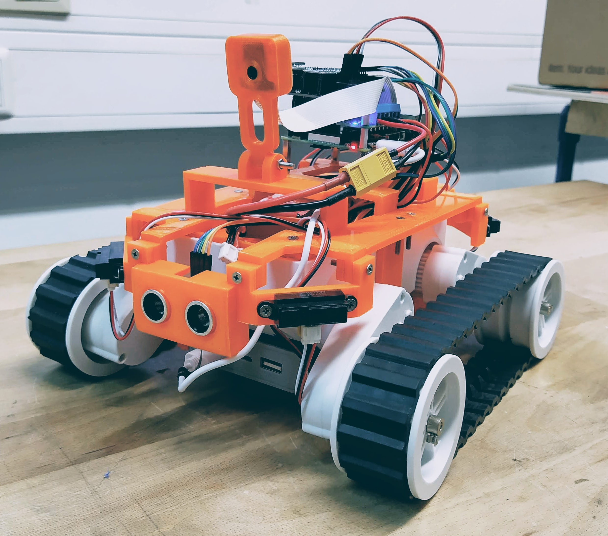

# Rover Robe V3

| #    | Amount | Part                     | Orientation |
| ---- | ------ | ------------------------ | ----------- |
| 1    | 1      | bottom-body-xx.stl       | normal      |
| 2    | 1      | camera_stand-xx.stl      | sideways    |
| 3    | 2      | corner-left-xx.stl       | upside-down |
| 4    | 2      | corner-right-xx.stl      | upside-down |
| 5    | 2      | flank-xx.stl             | upside-down |
| 6    | 1      | powerbank-bay-A-xx.stl1 | sideways    |
| 7    | 1      | powerbank-bay-B-xx.stl1 | normal      |
| 8    | 2      | Infrared-left-xx.stl     | normal      |
| 9    | 2      | Infrared-right-xx.stl    | normal      |
| 10   | 1      | raspberry-pi-stand-x.stl | upside-down |
| 11   | 2      | ultrasonic-sr04-xx.stl   | front-down  |
| 12   | 1      | camera_front_box_xx.stl  | normal      |
| 13   | 1      | camera_back_cover_xx.stl | normal      |
| Add-on  | 1      | rover_stand.stl2 | normal      |

* 1The 3D models are designed for this powerbank https://www.gotronic.fr/art-batterie-externe-usb-upbk15000bk-28901.htm (Nedis UPBK15000BK) and needs to be adapted to other powerbanks.
* 2 Add-on to lift the rover while testing.